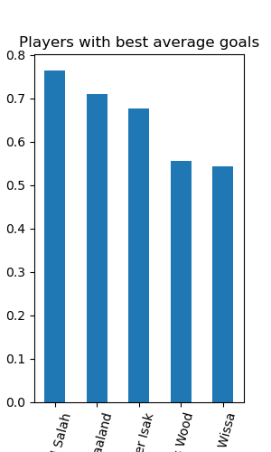

# Data-Science-Exploration-of-English-Premier-League-Statistics

# ⚽ Premier League Player Statistics Analysis (2024–2025)

This project presents an exploratory data analysis of Premier League players from the 2024–2025 season, using a custom dataset created by me but from real data available on the official Premier League website.

##  Objective
To identify the top-performing players and teams based on various metrics:
- Average goals per game
- Shooting precision
- Scoring efficiency
- Headed goals percentage

##  Tools & Libraries
- Python 3
- pandas
- matplotlib

##  Key Analysis
- Top 5 players with the best average goals
- Top 5 teams based on goal efficiency
- Shooting precision for both players and teams
- Headed goal percentage ranking

##  Repository Structure
- `notebook.ipynb` → Full analysis with visualizations
- `.png` images → Graphs included in the analysis (optional)
- `README.md` → Project overview

##  Visualizations
Visual bar charts were created to highlight performance metrics, such as:
- Average goals by player
- Shooting precision by team
- Scoring efficiency and headed goals

## Author
Oscar Medina 

